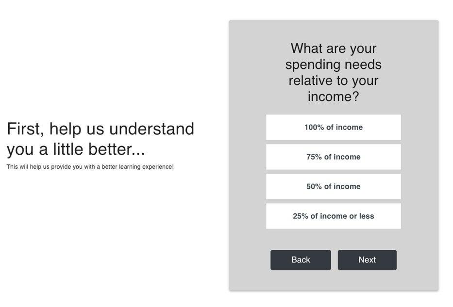
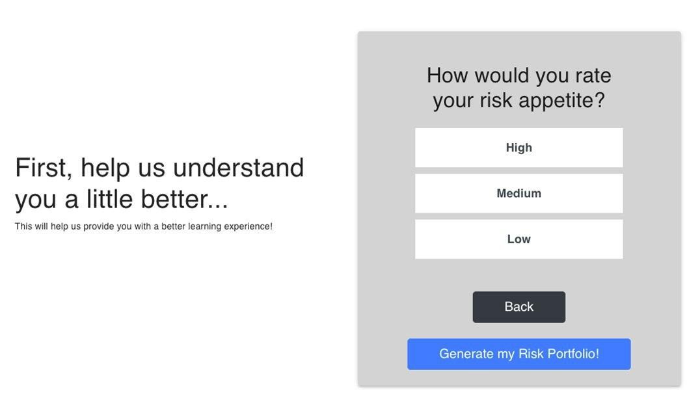
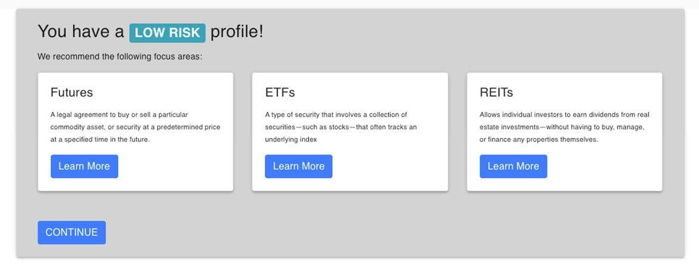
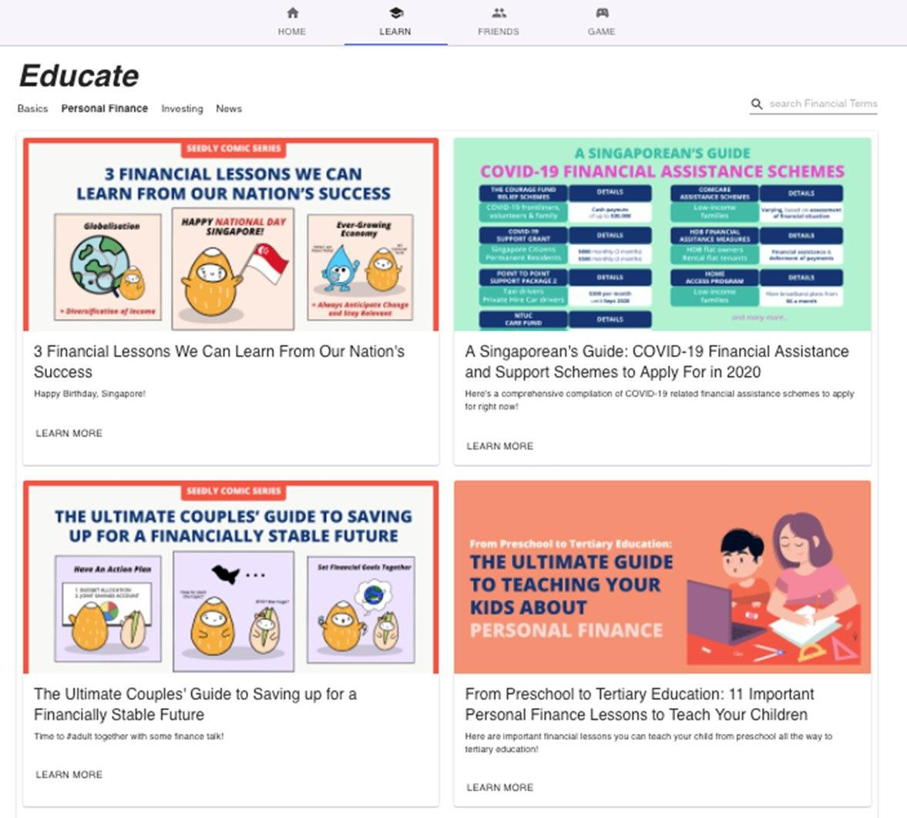
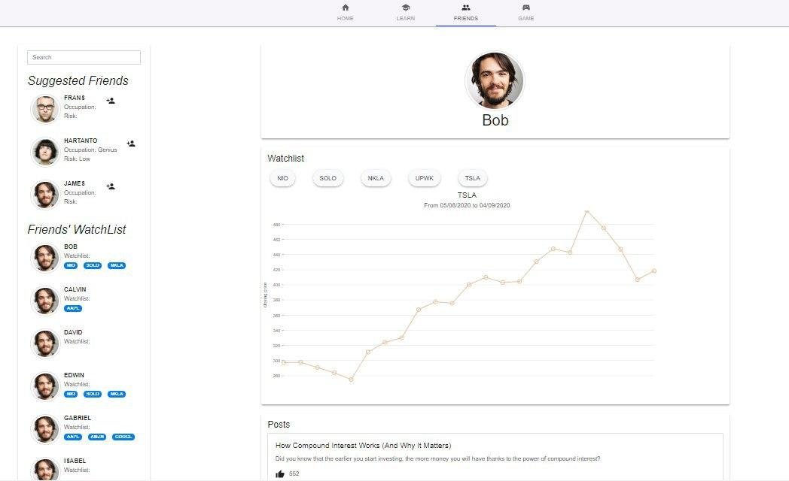
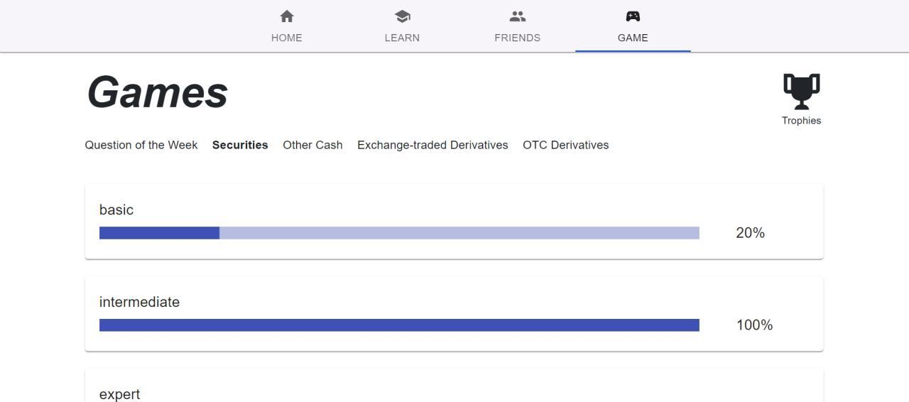
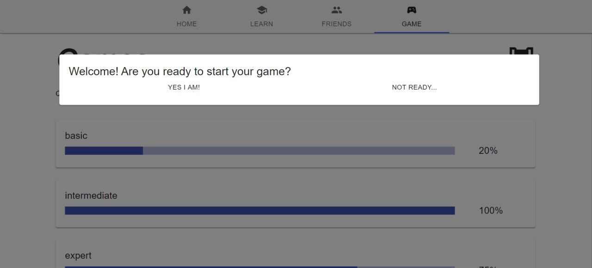
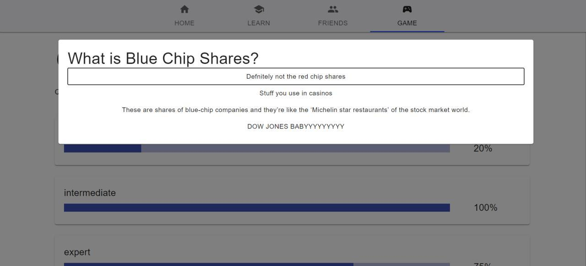
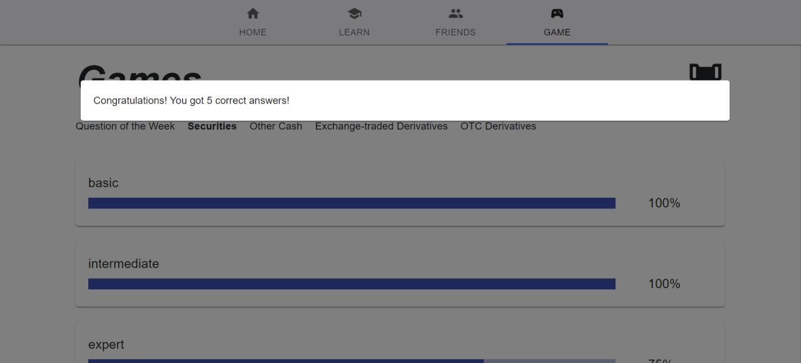

# SAVVY+

One-stop platform that provides youths with easy access to simple yet useful learning resources, an online community of like-minded individuals and engaging tools to track their learning progress.

## Financial Profiling
For new users, we perform a short user profiling survey to curate personalized content tailored to their risk profiles and better shape their learning experience.

  
   
  

## Learn/Explore
Provides vast amount of financial materials into distinct categories that allow users to easily find materials based on their needs for them to embark on their financial planning journey.

  

## Community & Social Media
Many questions, but find it difficult to seek help? This feature to mimic a social media environment where youths can have their questions answered, share interesting financial posts and interact with like-minded individuals.

  

## Gamification
Gamified the user’s learning experience by having lightning quizzes under the Game tab to test their knowledge. We also provide incremental rewards to encourage continuous engaged learning.

  
   

  
   

## Built With

* Frontend
  * [ReactJS](https://reactjs.org/)
  * [Bootstrap](https://react-bootstrap.github.io/)
  * [material-ui](https://material-ui.com/)
  * [nivo.rocks](https://nivo.rocks/)

* Backend & Deployment
  * [Flask](https://flask.palletsprojects.com/en/1.1.x/)
  * [Gunicorn](https://gunicorn.org/)
  * [Nginx](https://www.nginx.com/)

* Amazon Cloud Platform
  * [Amazon EC2]()
  * [Amazon S3]()
  * [Amazon RDS]()

## Authors

* **Ong Jun Xiang** - *Frontend Development* - [ongjx](https://github.com/ongjx)
* **Sherman** - *Frontend Development* - [shermenleejm](https://github.com/shermenleejm)
* **Rachel Lui** - *UI/UX Designer* - [rachel-lui](https://github.com/rachel-lui)
* **Zexel Lew** - *Backend Development* - [zexellew ](https://github.com/zexellew)
* **Kelvin** - *Backend Development* - [kelvinngsl](https://github.com/kelvinngsl)

